# EC2 Hardened Node Deployment
Proyecto completo de administración de servidores Linux en AWS: instalación y hardening de Apache, monitoreo, creación de AMI, plantillas de lanzamiento y Auto Scaling Group. 
Incluye script de autocuración y despliegue de un CV digital.
Autora: Briyit Rodríguez

##  Vista previa del resultado CV digital 

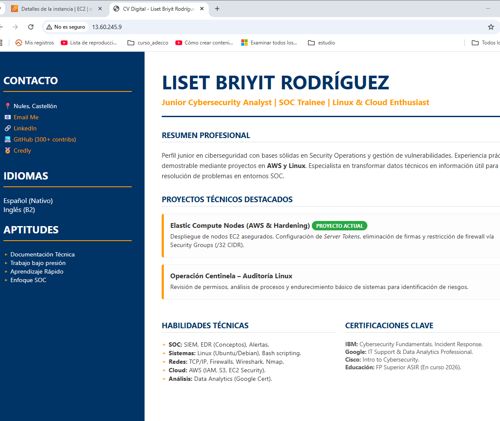

## 1. Inicio del proyecto
Este proyecto combina dos líneas de trabajo:
- Elastic Compute Nodes (EC2): creación, administración y automatización de instancias Linux.
- Servidor Apache: instalación, configuración, hardening y despliegue de un sitio web (CV digital).

## 2. Acceso a la instancia EC2
### 2.1. Encender la instancia
Desde la consola de AWS:
- Seleccionar la instancia creada previamente
- Hacer clic en Start Instance
- 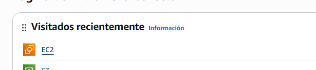
- 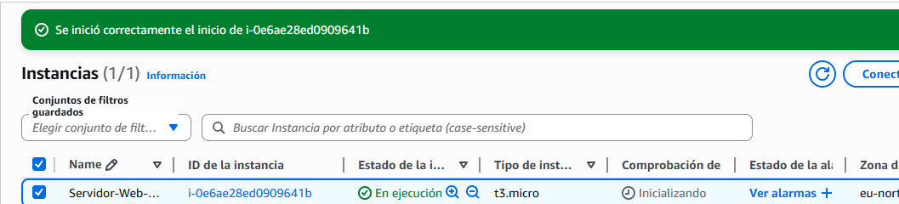
- 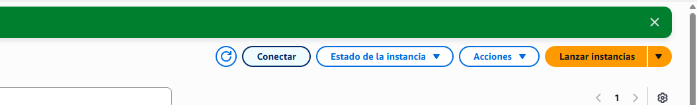
  
### 2.2. Conexión desde Windows mediante SSH
- Abrir CMD
```Codigo
Windows + R
```
- cmd
- Ir a la carpeta donde está la clave .pem
```bash
cd Desktop
cd aws
```
Conectarse a la instancia
```bash
ssh -i "nombre.pem" ec2-user@IP_PUBLICA
```
- 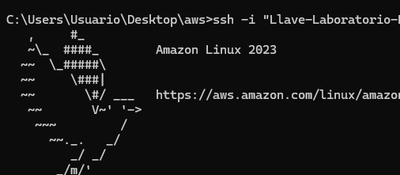
## 3. Instalación del servidor Apache
Una vez dentro de la instancia Amazon Linux 2023:

### 3.1. Intento inicial (incorrecto en Amazon Linux)
```bash
sudo apt update
```
- 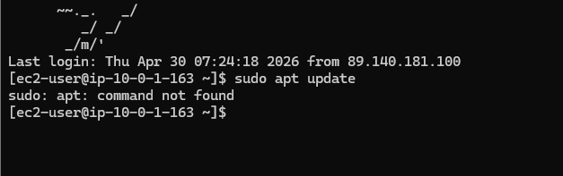
- 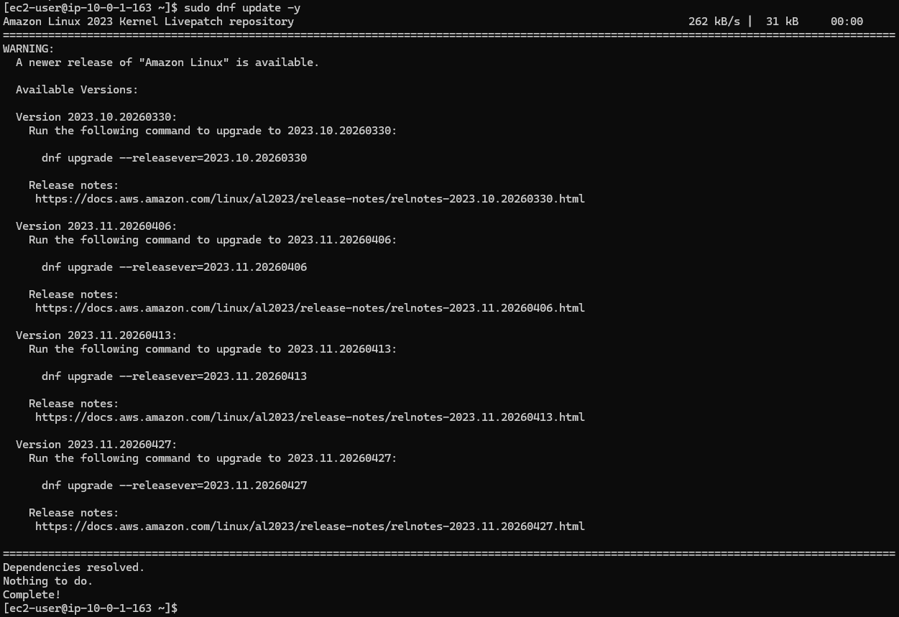

### 3.2. Instalación correcta (familia Red Hat)
```bash
sudo dnf install httpd -y
```
- 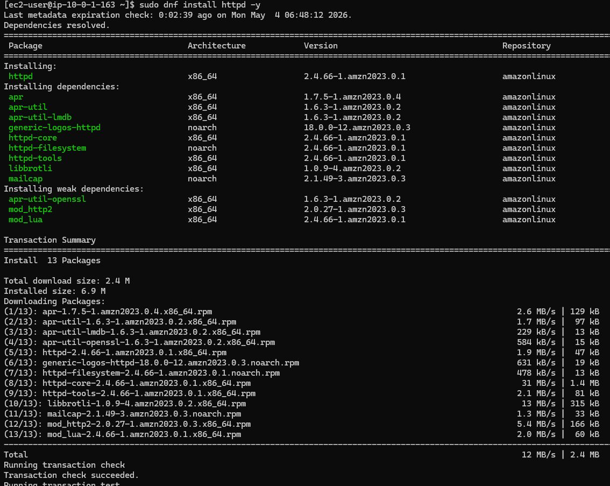
## 4. Administración del servicio Apache
- Iniciar Apache
```bash
sudo systemctl start httpd
```

- Comandos usados
  - Estado:

  ```bash
  sudo systemctl status httpd
  ```
  - Reiniciar:
  
  ```bash
  sudo systemctl restart httpd
  ```
  
  - Logs de error:
  
  ```bash
  sudo tail -f /var/log/httpd/error_log
  ```
  
  - Logs de acceso:
  
  ```bash
  sudo tail -f /var/log/httpd/access_log
  ```
- 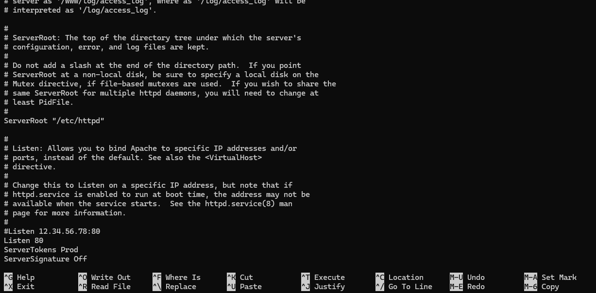

## 5. Hardening del servidor Apache
### 5.1. Ocultar información del servidor
Editar:

```bash
sudo nano /etc/httpd/conf/httpd.conf
```

Añadir:

```bash
ServerTokens Prod
ServerSignature Off
```

Reiniciar:

```bash
sudo systemctl restart httpd
```bash

### 5.2. Desactivar listado de directorios
Buscar:

```bash
<Directory "/var/www/html">
```

Cambiar:

```bash
Options Indexes FollowSymLinks
```

Por:

```bash
Options -Indexes +FollowSymLinks
```
- Guardar y salir:
- Ctrl + O, Enter → Ctrl + X
- 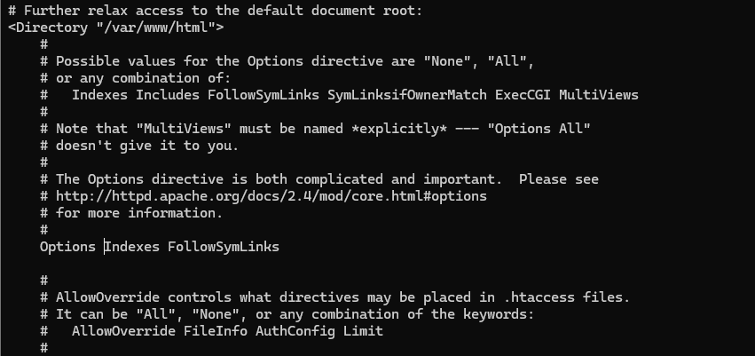
- 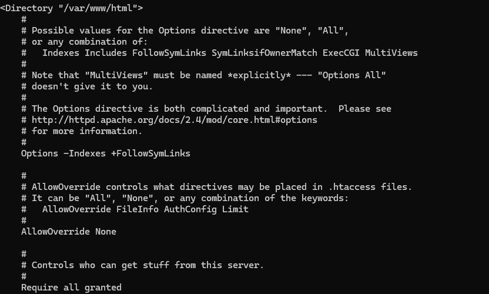
- 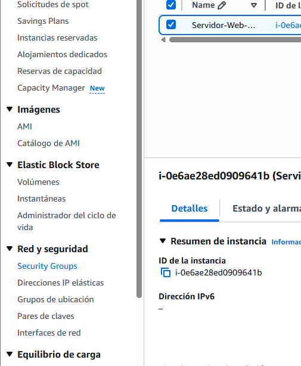


## 5.3. Configuración del Security Group
En AWS:

- Abrir Security Groups
- Editar reglas de entrada

Añadir:

```bash
Tipo: HTTP
Puerto: 80
Origen: 0.0.0.0/0
```
- 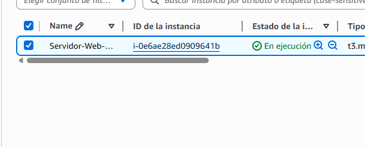
- 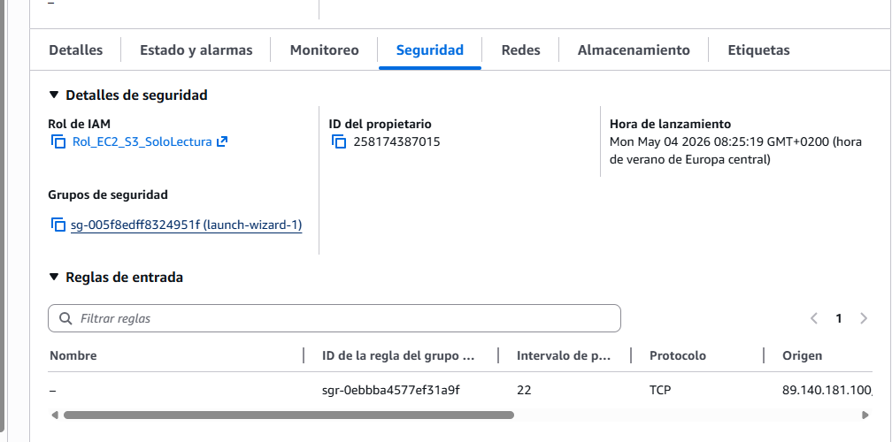
- 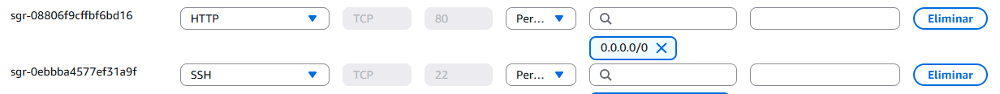
- 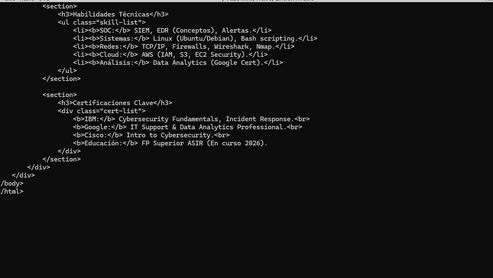
- 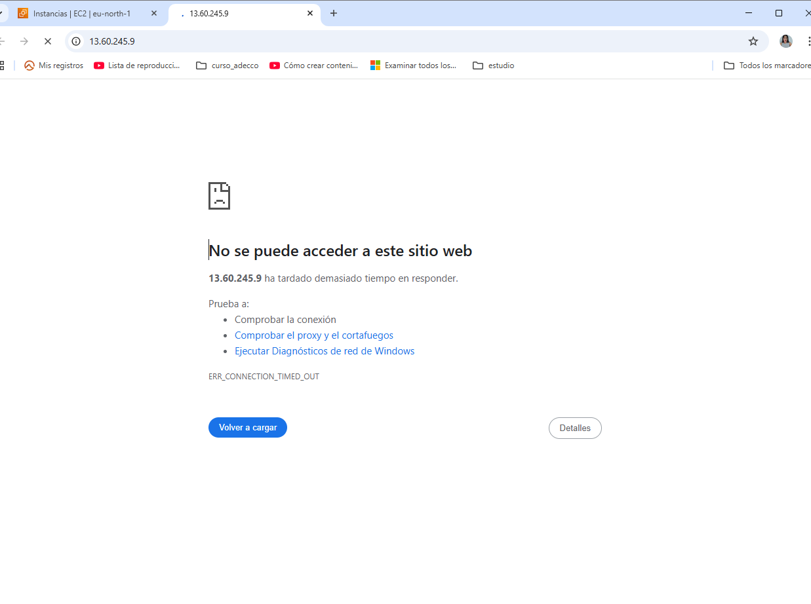


## 6. Creación del sitio web (index.html)
### 6.1. Crear archivo
```bash
sudo nano /var/www/html/index.html
```
### 6.2. Contenido
Incluye tu CV digital con HTML + CSS generado parcialmente con IA para agilizar el maquetado.

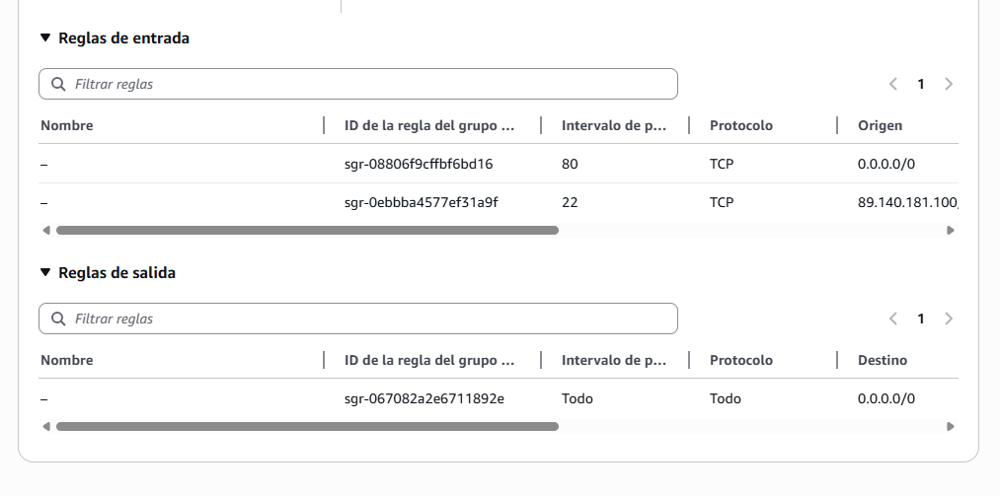

## 7. Prueba del sitio web
Copiar la IP pública y abrir:

```bash
http://IP_PUBLICA
```
no carga:
- Revisar SG
- Revisar Apache
- ```bash
  sudo systemctl start httpd
  sudo systemctl status httpd
  ```

- 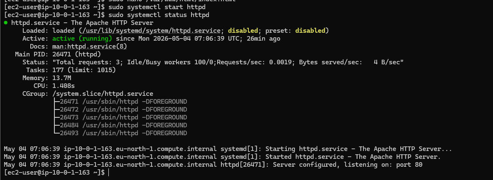
- 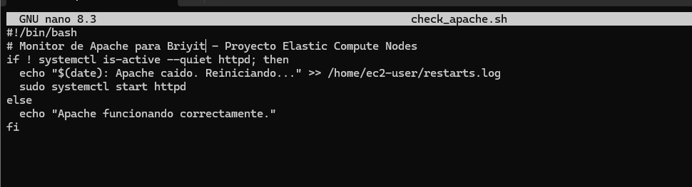
- 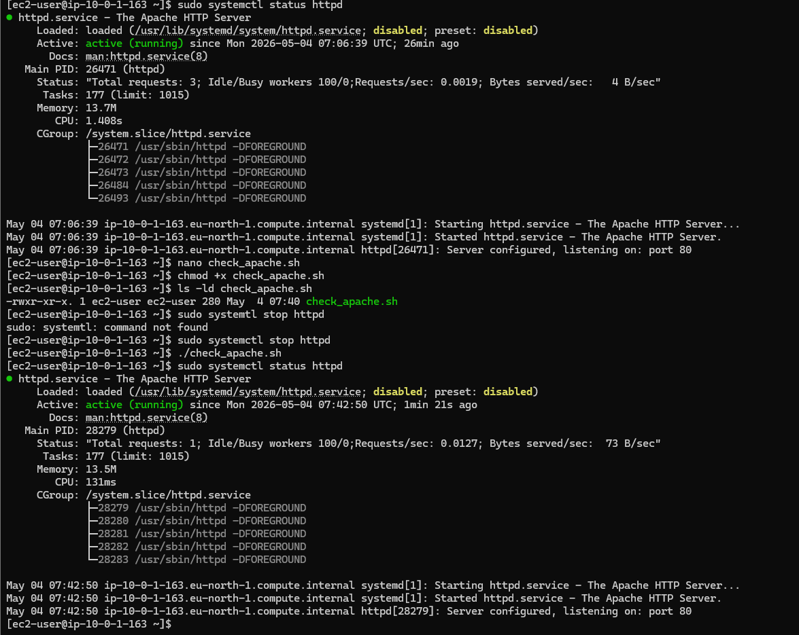
- 

## 8. Script de autocuración (Auto‑Recovery Script)
### 8.1. Crear archivo
```bash
nano check_apache.sh
```

### 8.2. Versión final del script
```bash
#!/bin/bash
# Monitor de Autocuracion - Biset Rodriguez

if ! systemctl is-active --quiet httpd; then
  echo " ALERTA: Apache esta caido. Iniciando protocolo de recuperacion..."
  sudo systemctl start httpd
  echo " REPARADO: El servicio Apache ha sido levantado exitosamente."
else
  echo "SISTEMA OK: Apache funcionando correctamente."
fi
```
- 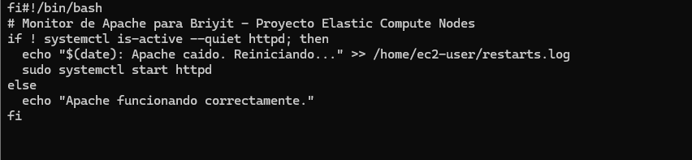
- primera version
- ```bahs
  chmod +x check_apache.sh
  ```
- cambio de version para que cuando se ejecute salga en la terminal que se ejecuto 

### 8.3. Prueba manual
  - Detener Apache:

  ```bash
  sudo systemctl stop httpd
  ```

- Ejecutar script:
  
  ```bash
  ./check_apache.sh
  ```
  - Verificar:
  
  ```bash
  sudo systemctl status httpd
  ```
--- 

- [](imagenes/_23.png)
- [](imagenes/_24.png)
- [](imagenes/_25.png)
- [](imagenes/_26.png)
- [](imagenes/_22.png)
- [](imagenes/_28.png)

--- 
## 9. Supervisión de logs
```bash
sudo tail -f /var/log/httpd/access_log
```
Probar rutas 404:

```bash
http://IP/admin
http://IP/wp-login.php
http://IP/.env
http://IP/config.php
```
- [](imagenes/_29.png)
- [](imagenes/_30.png)
- [](imagenes/_31.png)
- [](imagenes/_32.png)

## 10. Creación de la AMI personalizada
### 10.1. Crear imagen
EC2 → Instancias → Acciones → Imágenes → Crear imagen


Nombre: CV-Liset-Hardened-v1

Descripción: Apache + CV + Hardening + Auto‑Recovery

- [](imagenes/_33.png)
- [](imagenes/_34.png)
- [](imagenes/_35.png)


### 10.2. Esperar estado “available”

- [](imagenes/_36.png)

## 11. Creación de la Launch Template
EC2 → Launch Templates → Crear plantilla
```text
AMI: CV-Liset-Hardened-v1

Tipo: t3.micro

Key Pair: tu .pem

SG: el que permite puerto 80
```
- [](imagenes/_37.png)
- [](imagenes/_38.png)
- [](imagenes/_39.png)
- [](imagenes/_40.png)
- [](imagenes/_41.png)
- [](imagenes/_42.png)
## 12. Creación del Auto Scaling Group
### 12.1. Nueva versión de la plantilla
Ajustar SG correcto

- Verificar VPC correcta (...bd1a4)
- [](imagenes/_44.png)

### 12.2. Configuración del ASG
```text
Min: 1

Max: 3

Desired: 1
```
- [](imagenes/_45.png)


- Métrica de escalado
- CPU Utilization
- Target: 70%
- [](imagenes/_46.png)

- [](imagenes/_47.png)
- [](imagenes/_48.png)
- [](imagenes/_49.png)
- [](imagenes/_50.png)

## 13. Verificación del Auto Scaling
- EC2 → Instancias
- Aparece nueva instancia generada automáticamente
- Probar IP pública
- [](imagenes/_51.png)

- no carga:

- Revisar Apache
- Revisar SG
- [](imagenes/_52.png)

## 14. Corrección del estado “disabled”

```bash
sudo systemctl start httpd
sudo systemctl enable httpd
```
- [](imagenes/_53.png)
- [](imagenes/_54.png)

## 15. Problemas detectados y soluciones
1. Instancia sin SG correcto
Verificar pestaña Security  
- [](imagenes/_55.png)

2. Instancia sin el CV
La AMI usada no contenía el CV.
Solución: crear AMI desde la instancia correcta.

3. Auto Scaling recrea instancias
ASG detecta que la capacidad mínima no se cumple.

- [](imagenes/_56.png)
- [](imagenes/_57.png)
- [](imagenes/_58.png)
- [](imagenes/_59.png)
- [](imagenes/_60.png)
## 16. Cómo detener el Auto Scaling Group
Auto Scaling Groups → Seleccionar → Editar:
```text
Código
Desired: 0
Min: 0
Max: 0
```
- [](imagenes/_61.png)
- [](imagenes/_62.png)
- [](imagenes/_63.png)

- Luego terminar instancias manualmente.
- [](imagenes/_64.png)
- [](imagenes/_65.png)


## 17. Mejoras pendientes
- Crear AMI final con CV + hardening + script
- Configurar User Data para automatizar despliegue
- Integrar monitoreo con CloudWatch

## 18. Costos y uso
Créditos restantes: 119,25 USD  
Días restantes: 137  
- [](imagenes/_66.png)
- [](imagenes/_67.png)


### Estado actual del proyecto
- ✔ EC2 configurado
- ✔ Apache instalado y endurecido
- ✔ CV desplegado
- ✔ Script de autocuración funcionando
- ✔ Logs supervisados
- ✔ AMI creada
- ✔ Launch Template creada
- ✔ Auto Scaling Group configurado
- ✔ Proyecto documentado paso a paso
- 🔎Pendiente: AMI final + User Data + IAM + despliegue automático
