# Fortress IAM – Guía Técnica de Seguridad en AWS
El objetivo de Fortress IAM es comprender la lógica detrás de la seguridad en AWS, uno de los pilares fundamentales de cualquier arquitectura en la nube.
En esta fase nos enfocamos en IAM (Identity and Access Management) y en los fundamentos de la seguridad perimetral.

En AWS, la regla de oro es clara:

Principio de Menor Privilegio:  
**Ningún usuario, servicio o máquina debe tener más permisos de los estrictamente necesarios.**

## 1. MFA

### 1.1 Activar MFA en el Root User

Este procedimiento también está documentado en:

Ruta: IAM → Dashboard → Security Recommendations → MFA

### 1.2 Activas MFA en usuario admin
- 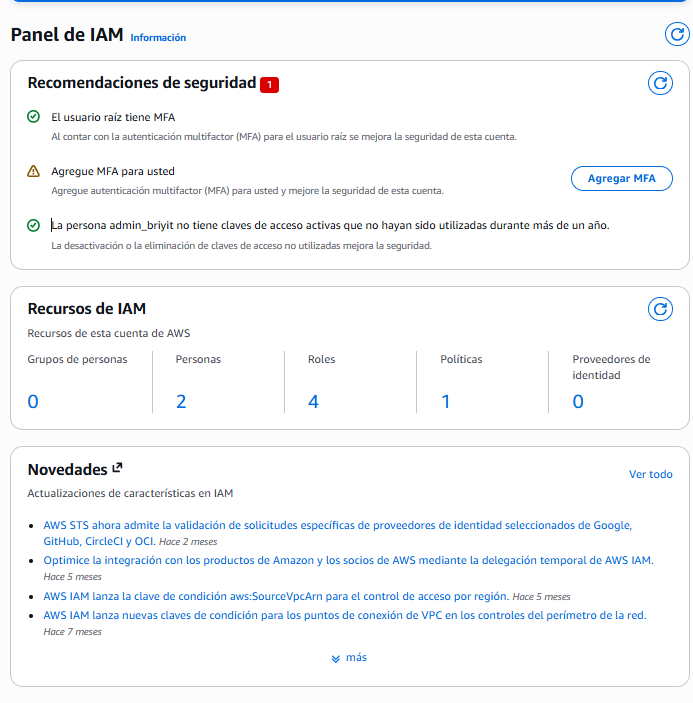
- Pasos realizados:
- Entrar a IAM.
- Seleccionar Enable MFA para el usuario raíz.
- 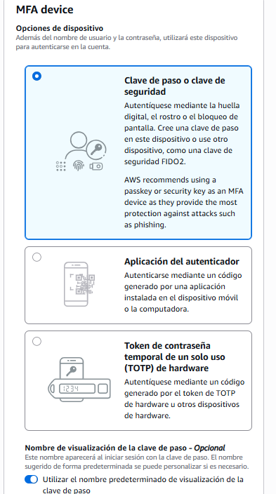
- Elegir Authenticator App.
- Asignar nombre al dispositivo  admin_briyit.
- 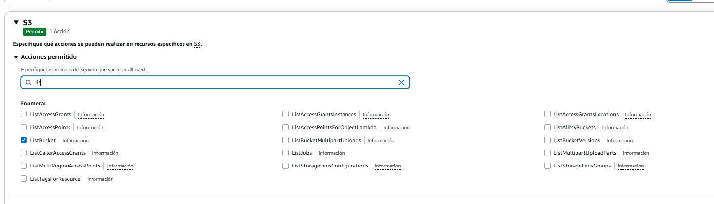
- Escanear el código QR desde la app de autenticación.
- 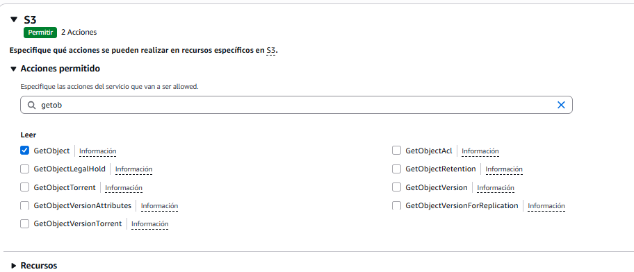
- Ingresar los códigos generados.
- 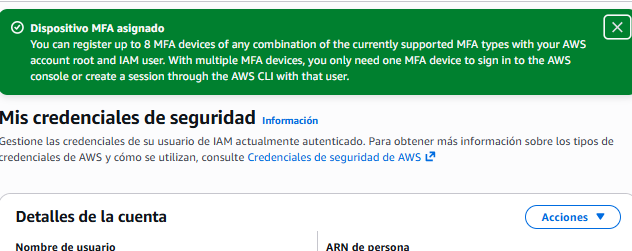

## 2. Creación de Grupos IAM (Admins, Developers, Auditors)
- Organizar permisos mediante grupos es una buena práctica esencial.
- Permite escalar, mantener orden y evitar errores humanos.
- 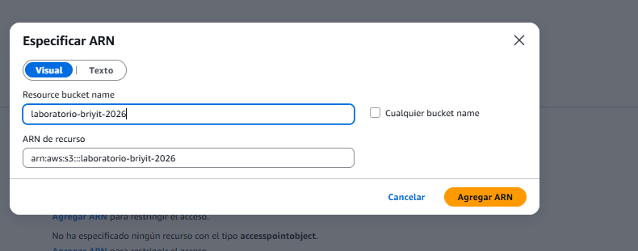
- 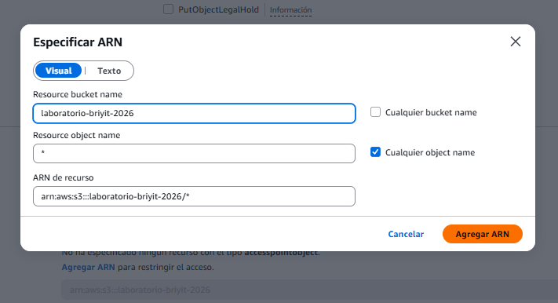
- 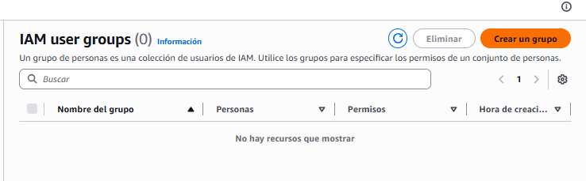
  
### 2.1 Crear los grupos
Ruta: IAM → User Groups → Create group

#### Se crearon los siguientes grupos:

--- 
**Grupo 1**: Admins
**Nombre**: Admins

**Usuarios**: admin_briyit

####Política: AdministratorAccess

- 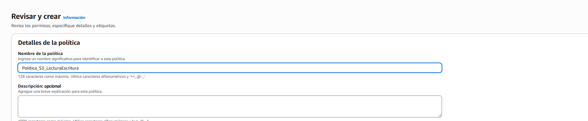
- 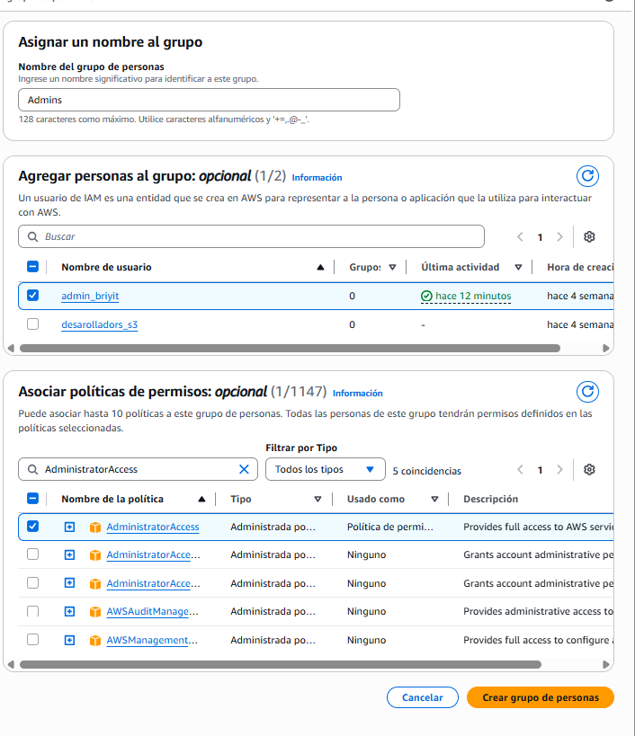

--- 
**Grupo 2**: Developers
**Nombre**: Developers

**Usuarios**: desarrollador_s3

**Política**: PowerUserAccess
  - Permite administrar casi todos los servicios
  - No permite modificar IAM (evita que un developer se dé permisos de admin)

- 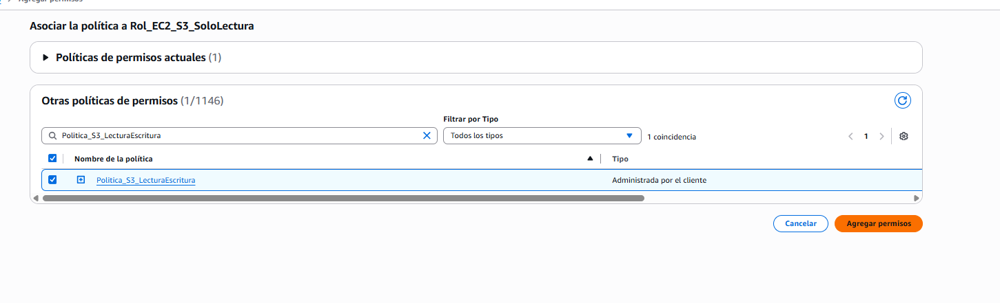

---
**Grupo 3**: Auditors
**Nombre**: Auditors

**Usuarios**: Ninguno por ahora
- 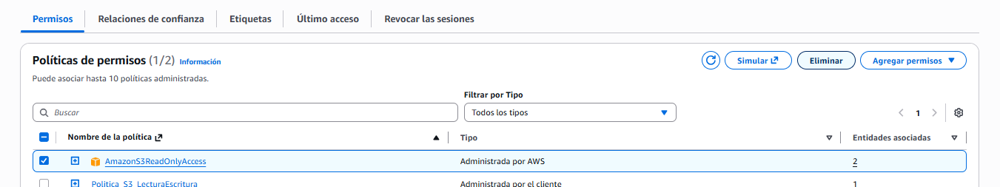
**Política**: ReadOnlyAccess
- El ícono de advertencia en Auditors es normal: solo indica que el grupo está vacío.
- 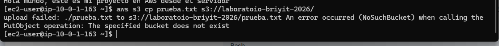

- 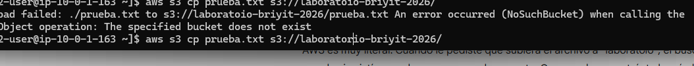

### 2.2 Ventaja operativa
Si mañana llega un nuevo desarrollador:
  - No necesitas recordar qué permisos darle.
  - Solo lo agregas al grupo Developers.
  - Automáticamente hereda todos los permisos correctos.

### 2.3 Verificación
- Ruta: IAM → Users
- Confirmar que:
- Los usuarios muestran permisos provenientes de Group
- No tienen políticas adjuntas directamente (Directly attached)

## 3. Costos y Uso – Interpretación Profesional

**uso y costo** 
- 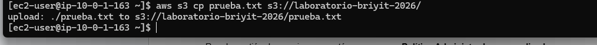

### 3.1 Acceder a Cost Explorer
- 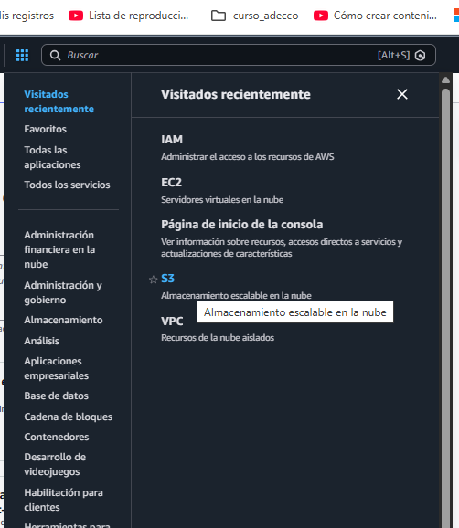
Ruta: Cost Explorer → Launch Cost Explorer

- Ajustes recomendados:
- Group by: Usage Type
- Granularidad: Daily
- Permite identificar exactamente qué recurso generó el costo.
- 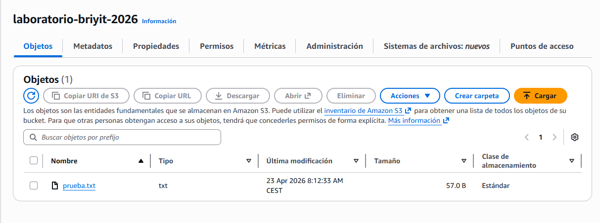
- 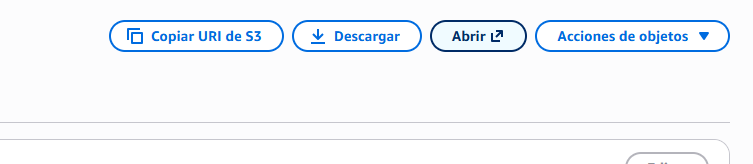
- 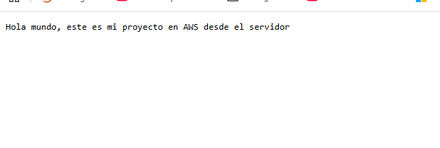

## 4. ¿Por qué Cost Explorer muestra $0 si el panel inicial muestra $0.59?
- 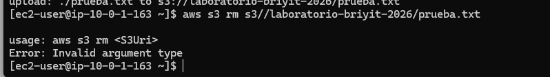

### Razón 1 — Créditos aplicados (la principal)
Tienes $119.41 USD en créditos.
AWS aplica automáticamente los créditos antes de mostrar el costo neto.

- Panel inicial → muestra costo bruto
- Cost Explorer → muestra costo neto (después de créditos)

Por eso aparece $0.

### Razón 2 — Latencia de actualización
Cost Explorer no es en tiempo real.

- Puede tardar 24–48 horas en reflejar datos recientes.
- El panel inicial se actualiza más rápido.

## 5. Anomalías detectadas por AWS
AWS detectó 1 anomalía.
- 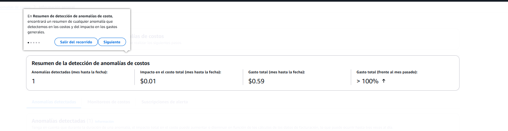
Esto no significa un error, solo un comportamiento inusual:

- “Normalmente gastas $0, hoy gastaste algo. Te aviso.”
- Impacto: $0.01 USD
- 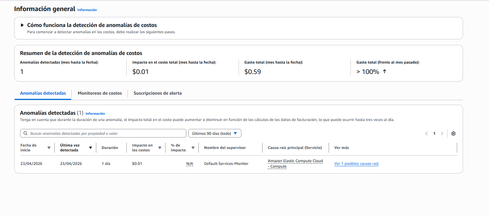
## 6. Análisis de causa raíz del costo
- 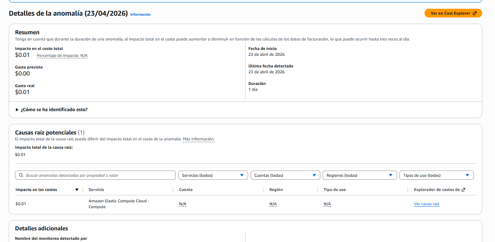
### 6.1 Identificación del recurso
En Cost Explorer:
- Group by: Usage Type
- Aparece: EUN1-BoxUsage:t3.micro
- Interpretación:
- EUN1 → Región Estocolmo
- BoxUsage:t3.micro → Costo por tener la instancia encendida
- 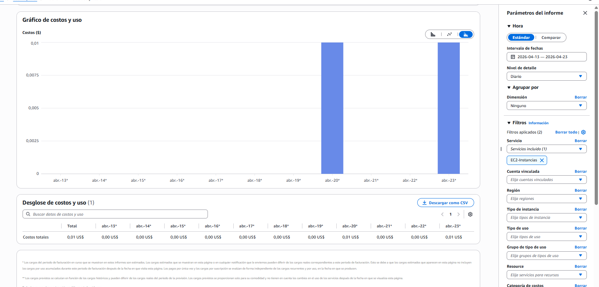
- 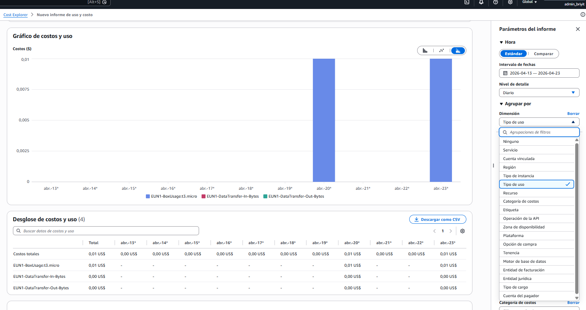

### 6.2 ¿Por qué cobró si t3.micro es Free Tier?
- Porque el Free Tier no aplica igual en todas las regiones.
- En regiones principales (Virginia, Ohio, Oregón) → sí es gratis
- En Estocolmo (eu-north-1) → puede no estar cubierto

### 6.3 Cómo hacerlo correctamente para la creación de proximas instancias 
Cambiar región (arriba a la derecha):
  - N. Virginia
  - Ohio
  - Oregón
  - Irlanda (más cercana a España)
  - Crear la instancia EC2 en esa región.

### 6.4 Tranquilidad
- Con $120 USD en créditos, gastarías $0.01 por sesión.
- Tendrías que encender la instancia 12.000 veces para consumirlos.
