# Global Assets Storage – Gestión Profesional de Versionado y Ciclo de Vida en S3
Este laboratorio forma parte del proyecto Fortress IAM y tiene como objetivo desplegar un repositorio de objetos con control de versiones y políticas de ciclo de vida, optimizando seguridad, resiliencia y costos mediante S3 Versioning y transiciones a S3 Glacier.

## 1. Control de Versiones (Versioning)
El versionado permite que, si un archivo se borra accidentalmente o es sobrescrito por error (o incluso por malware), S3 mantenga un historial completo de todas las versiones.
Habilitarlo no tiene costo directo, pero sí genera cargos de almacenamiento porque cada versión ocupa espacio.

- s3
- 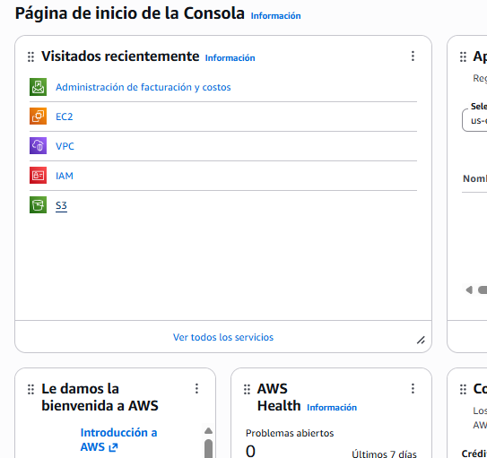
### 1.1 Habilitar Versioning en el bucket

- Entra al bucket laboratorio-briyit-2026.
- 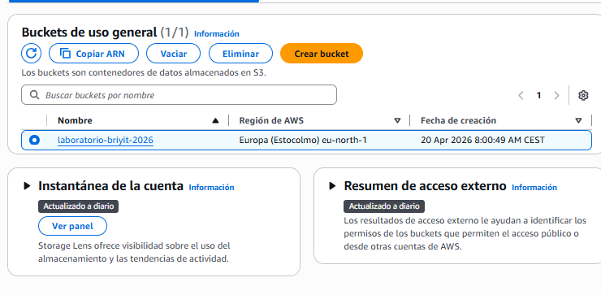
- Haz clic en el nombre del bucket para abrirlo.
- Ve a la pestaña Properties.
- 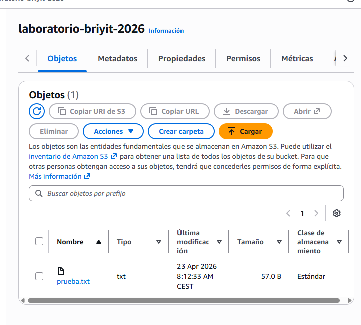
- Busca Bucket Versioning.
- Haz clic en Edit.
- Cambia el estado a Enabled.
- 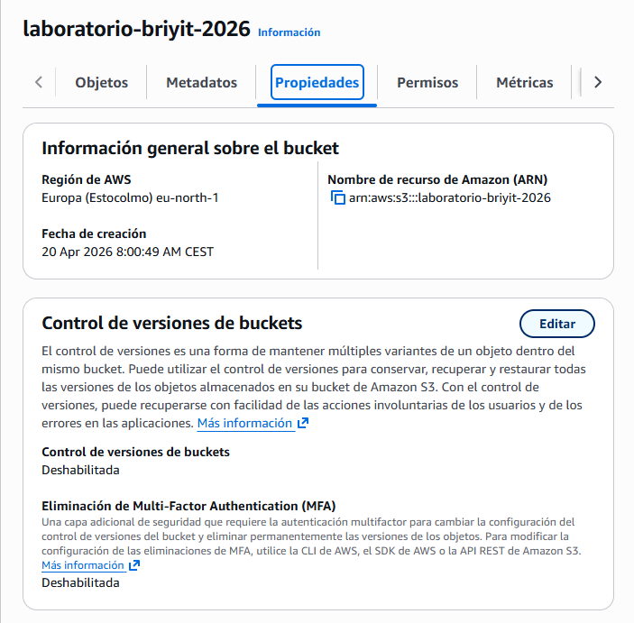
- Guarda los cambios.

### 1.2 Prueba de Fuego: Validar el Versionado
- Costos esperado
- Acción	Costo	Motivo
- Subir archivo (PUT)	$0.00	Las primeras 2,000 solicitudes PUT están en Free Tier
- Almacenar dos versiones	$0.00	5 GB gratis durante el primer año
- Mientras no superes los 5 GB, no pagarás nada.

### 1.3 Subir archivos desde EC2
- 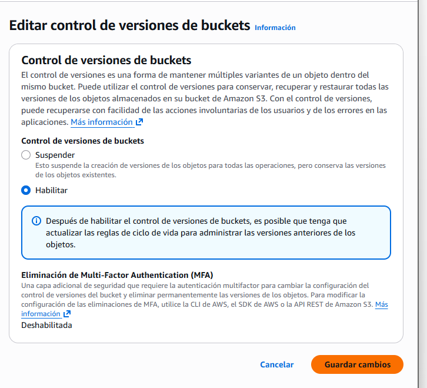
  
### 1. Encender la EC2 :Recuerda que la IP cambia cada día.

- 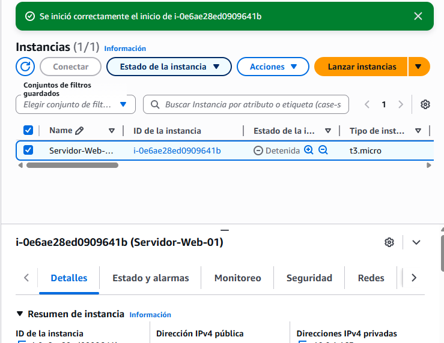
  
### 2. Conectarte por SSH

```bash
ssh -i llave-brixxx.pem ec2-user@IP_PUBLICA
```
### 3. Crear y subir la Versión 1
```bash
echo "Versión 1" > prueba.txt
aws s3 cp prueba.txt s3://laboratorio-briyit-2026/

```
### 4. Crear y subir la Versión 2
```bash
echo "Esta es la SEGUNDA versión del archivo, el versionado me protege" > prueba.txt
aws s3 cp prueba.txt s3://laboratorio-briyit-2026/
```
- 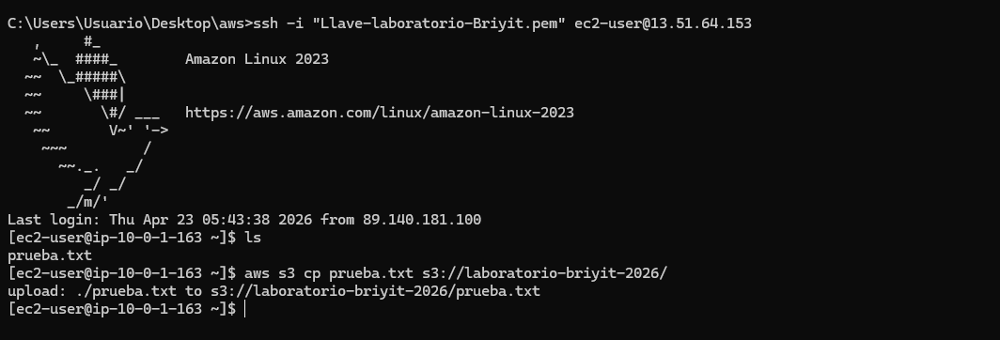
- 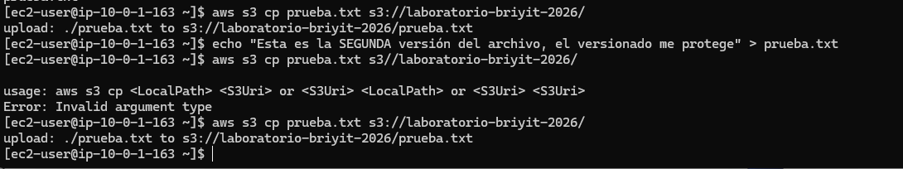

### 5. Verificar versiones
En el bucket → activar mostrar versions.

- 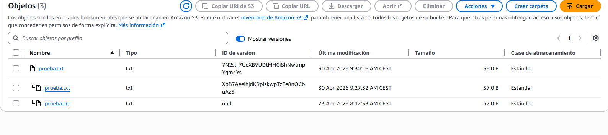


## 2. Políticas de Ciclo de Vida (Lifecycle Rules)
Las Lifecycle Rules permiten automatizar la transición de objetos a clases de almacenamiento más baratas, como S3 Glacier, ideal para archivos que no se usan frecuentemente.

- Costos
- Crear la regla → $0.00
- Transición a Glacier → $0.05 por cada 1,000 objetos
- En tu caso → $0.00 hoy (y en 30 días será una fracción de milésima de centavo)

### 2.1 Crear la Regla de Ciclo de Vida

- 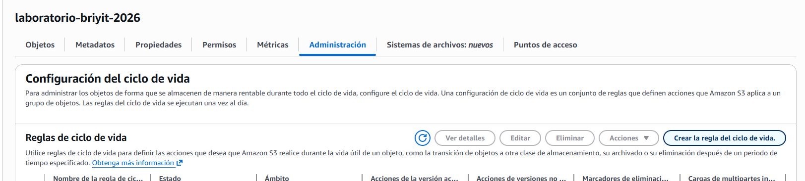
- Entra al bucket laboratorio-briyit-2026.
- Ve a la pestaña Administración.
- Haz clic en Crear Reglas de ciclo de vida.
- 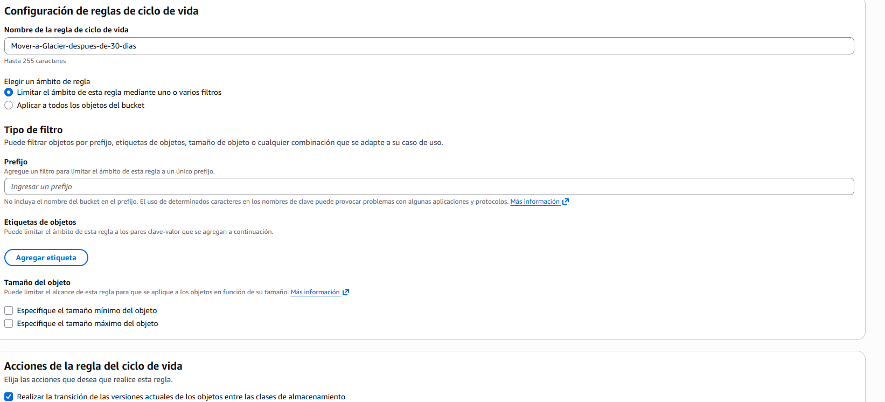
- Asignamos un nombre
- seleccionamos aplicar a todos los objetos del bucket
- Realizar la transición de versiones actuales de los objetos entre las clases de almacenamiento y REalizar la transición de las versiones desactualizadas de los ibjetos entre las clases de almacenamiento
- 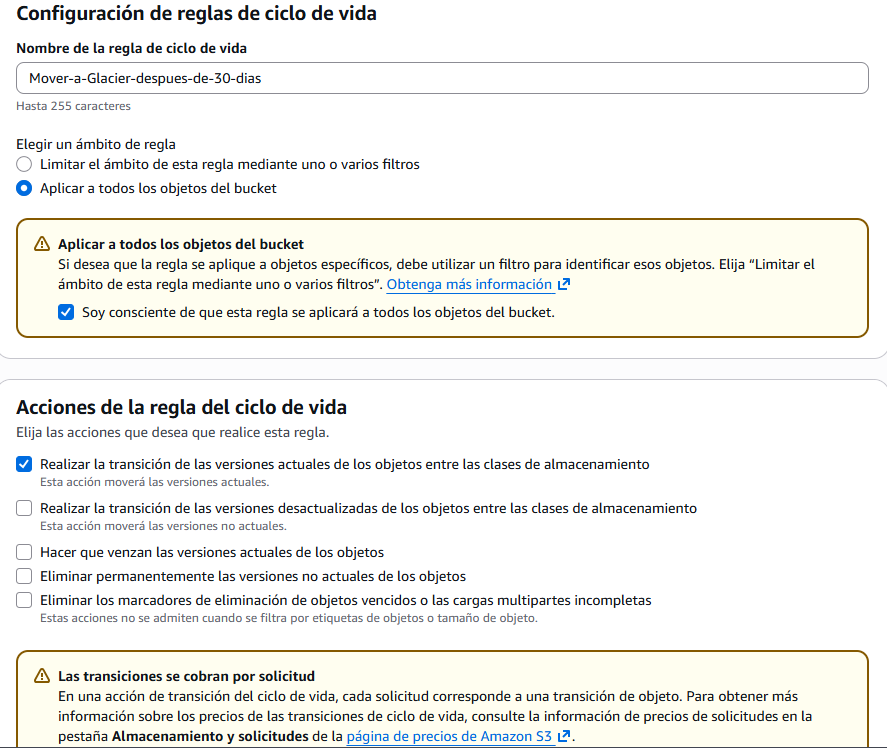
- 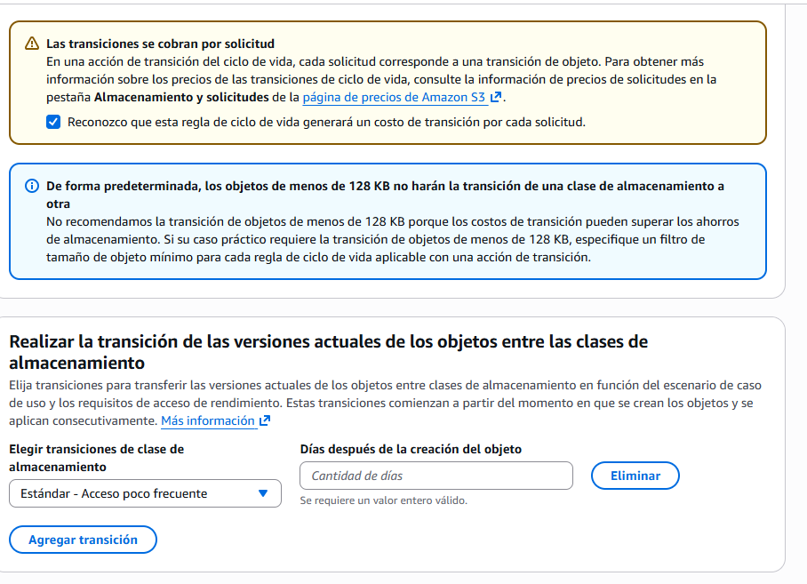
- Selecciono Glacier Flexible Retrieval.
- En "Días tras la creación del objeto", pon 30.
- clic en crear
- 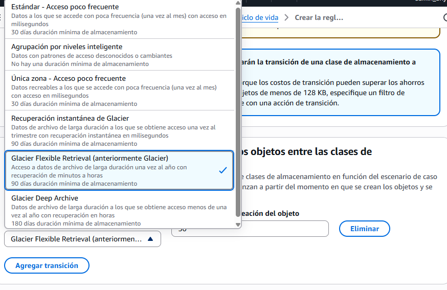
- 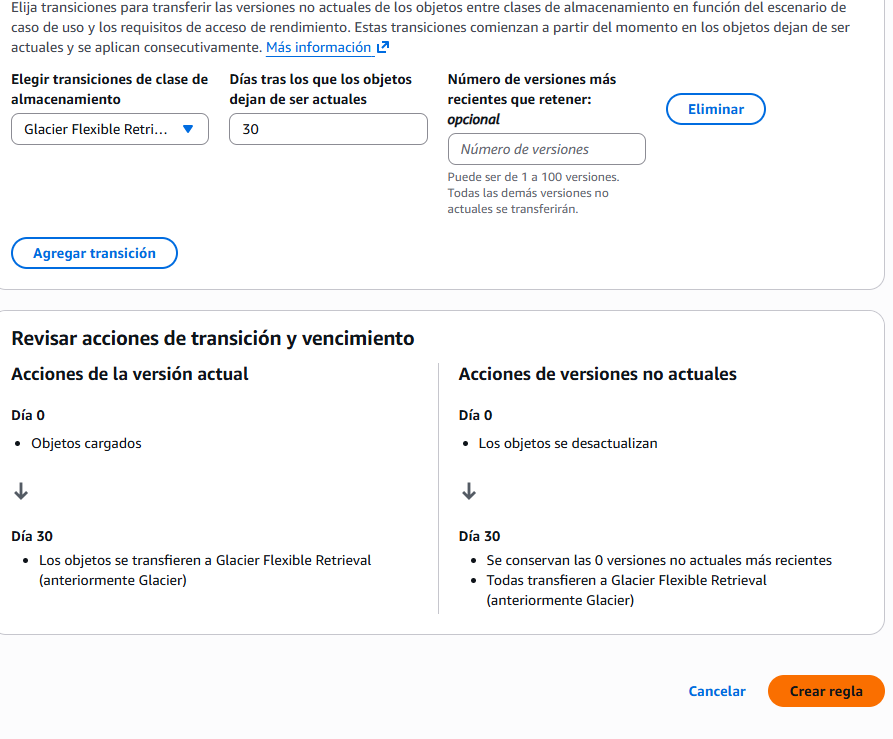
- 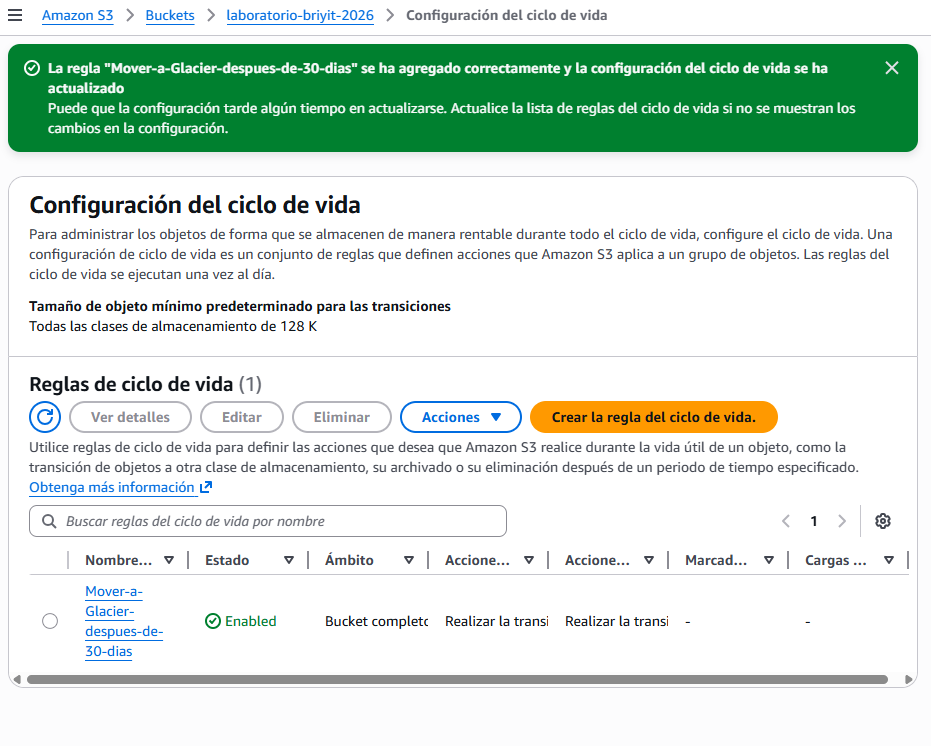

3. Cierre del laboratorio
- Cerrar sesión de EC2
- 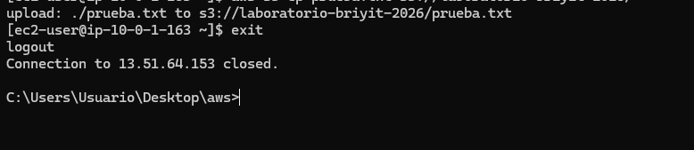
```bash
exit
```

- Apagar la instancia
- EC2 → seleccionar instancia → Detener
- 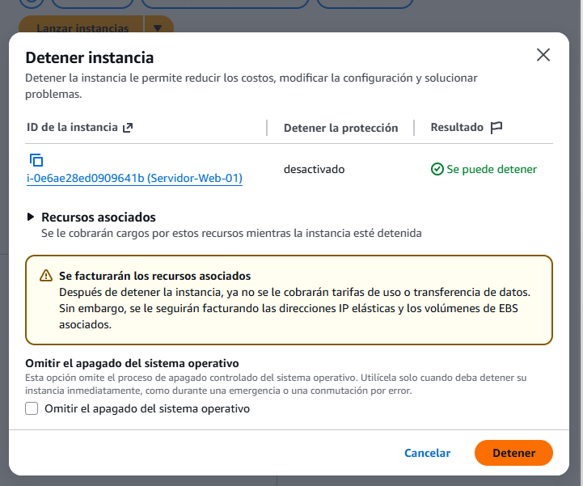

- Cerrar sesión de AWS
- Menú superior → Salir

## 4. Notas Técnicas Finales
- El versionado incrementa la resiliencia del bucket ante errores humanos o corrupción de datos.
- Las Lifecycle Rules permiten optimizar costos sin intervención manual.
- Glacier es ideal para archivos que no necesitas consultar frecuentemente.
- Este laboratorio sigue buenas prácticas de AWS:
- Versioning habilitado
- Ciclo de vida automatizado
- Uso eficiente del Free Tier
