# Creación de Bucket S3, asignación de rol a EC2 y pruebas de conexión
## Revisión de cargos en la cuenta
Al ingresar a la consola noté un pequeño cargo. Revisando la facturación entendí lo siguiente:
- 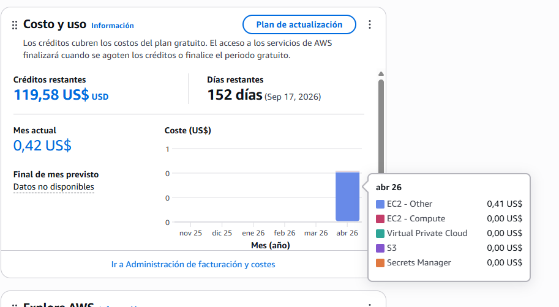
- **Este tipo de coste aparece bajo EC2 – Other.**
- Se produjo un gasto de **0.42 us$**correspondía al tiempo en que la instancia estuvo encendida o en proceso de lanzamiento.
- Desde febrero de 2024, AWS cobra por todas las direcciones IPv4 públicas, incluso en Free Tier.
- El coste aproximado es 0,005 USD por hora.

## 1. Creación del bucket S3 para almacenamiento
Mi objetivo era preparar un espacio donde mi servidor EC2 pudiera almacenar información. 
Para ello utilicé Amazon S3, que ofrece 5 GB gratuitos dentro del Free Tier. 
"Recordar que en el ejercicios anteriore ya creamos el rol y solo tiene el permiso de leer , en proximos ejercicios se le asignara los permisos pertinentes"

### Pasos realizados
- Ingresé a la consola de AWS y busqué el servicio S3 desde la barra superior.
- Seleccioné Crear bucket.
- 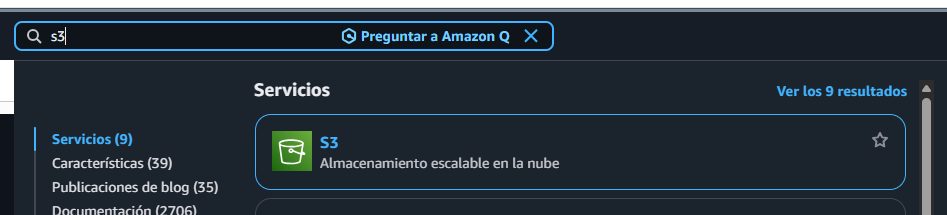
- clic en Crear bucket
- 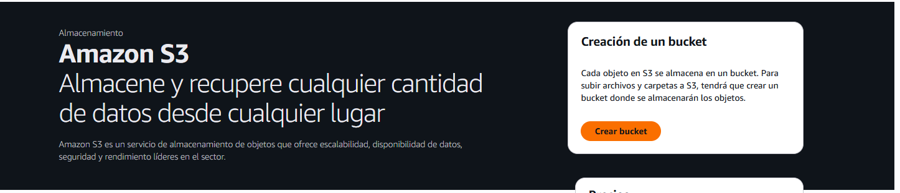
- Nombre del bucket: El nombre debe ser único en todo el mundo
- Regla: Solo minúsculas, números y guiones.
- 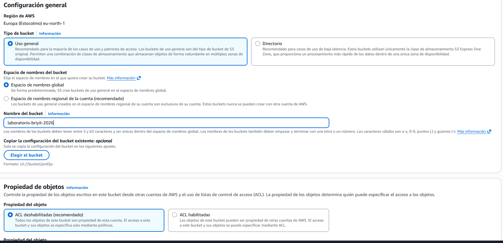
- Asigné el nombre: `laboratorio-briyit-2026 `
- Seleccioné la región eu-north-1 (Estocolmo) para mantenerla alineada con mi instancia EC2.
- Dejé activada la opción Bloquear todo el acceso público, ya que el acceso lo gestionará IAM, no el público.
- No modifiqué las opciones de cifrado ni versionado.
- 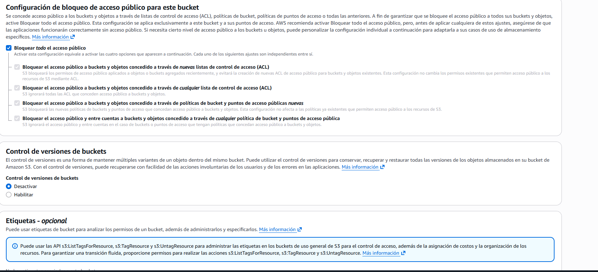
- Finalicé con Crear bucket.
- Con esto quedó creado el espacio de almacenamiento que utilizará mi servidor.
- 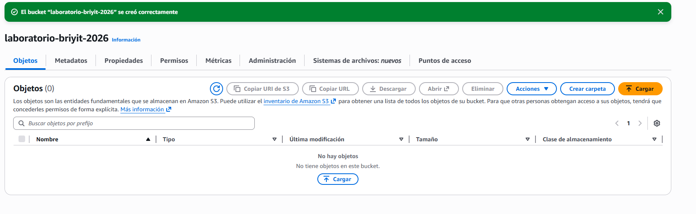


## 3. Asignación del rol IAM a la instancia EC2
Mi instancia EC2 necesitaba permisos para acceder al bucket S3. 
Para ello utilicé el rol que había creado previamente.

### Pasos realizados
- Entré en EC2 > Instancias.
- Seleccioné mi instancia Servidor-Web-01.
- 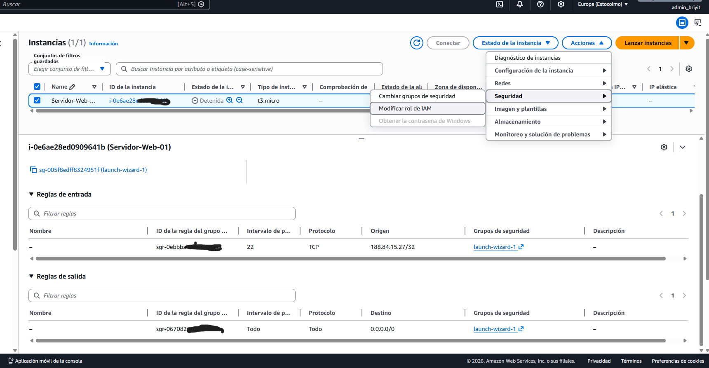
- Fui a Acciones > Seguridad > Modificar rol IAM.
- Seleccioné el rol:**Rol_EC2_S3_SoloLectura**
- Confirmé con Actualizar rol IAM.
- 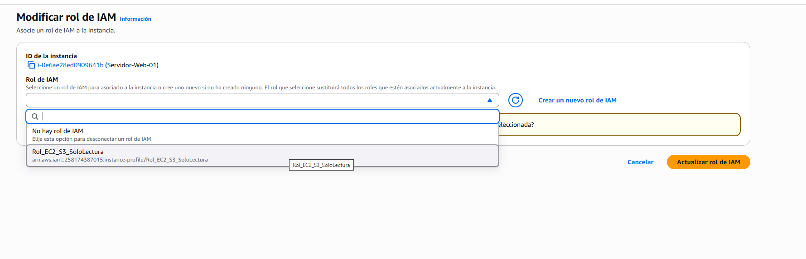
- Con esto, la instancia quedó autorizada para leer contenido desde S3.
- 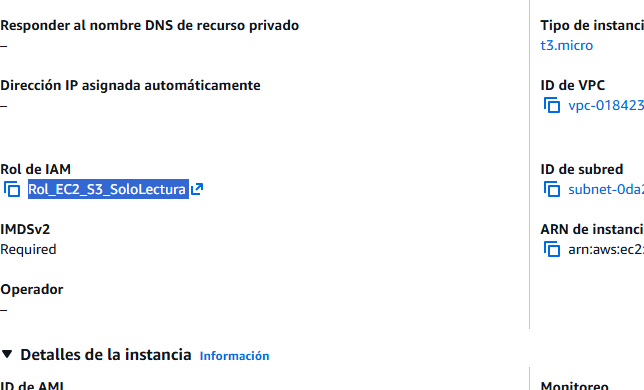

## 4. Encendido de la instancia y obtención de la nueva IP
Después de dos semanas detenida, la instancia recibió una nueva IP pública.

### Acciones realizadas
- Desde EC2 seleccioné Estado de la instancia > Iniciar.
- Esperé a que cambiara a Running.
- 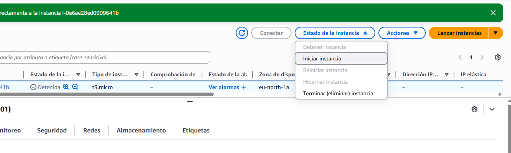
- Tomé nota de la nueva IP pública

## 5. Conexión SSH desde Windows
Para conectarme desde mi equipo Windows:

### Pasos
- Abrí CMD desde el menú Inicio.
-  windows + r
-  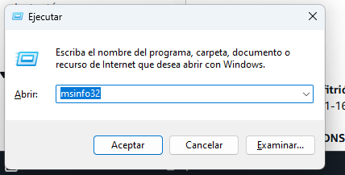
-  Escribo cmd , enter
-  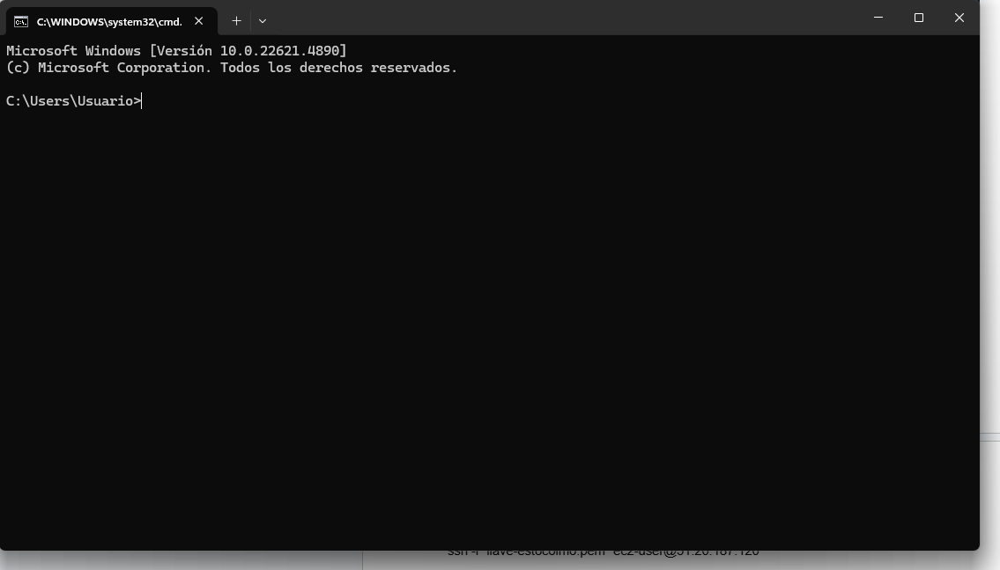
-  Me moví a la carpeta donde guardé mi llave .pem:

---
```bash
cd Desktop
```
---

- ya que la carpeta se encuentra en el escritorio

---
```bash
cd aws
```
---
Ejecuté la conexión SSH:

```bash
ssh -i "Llave_laboratotio_BriyXXX.pem" ec2-user@51.20.XXXXX
```
### Problema encontrado
Recibí el error:
- Connection timed out
- La causa fue que mi IP pública había cambiado, por lo que la regla de seguridad del puerto 22 ya no coincidía.
- 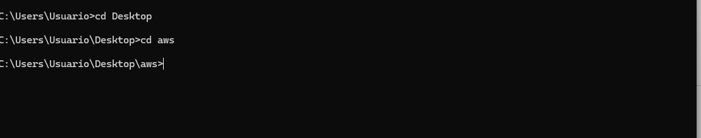
  
## 6. Actualización de la regla de seguridad (SSH)
- Para permitir mi nueva IP:
- Entré en EC2 > Instancias.
- Seleccioné Servidor-Web-01.
- Fui a la pestaña Seguridad y abrí el Security Group.
- Seleccioné Editar reglas de entrada.
- 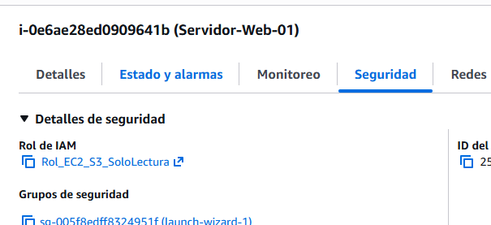
- 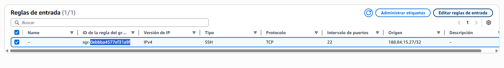
- 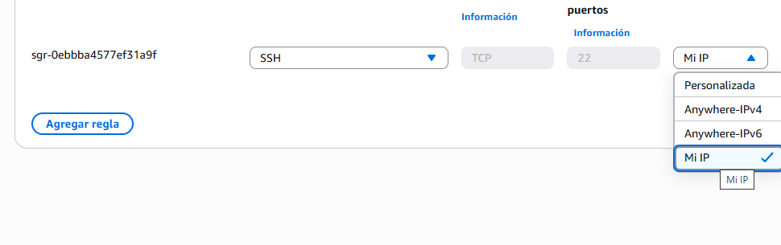
- En la regla del puerto 22, cambié el origen a My IP.
- Guardé los cambios.
- Tras esto, repetí el comando SSH y la conexión fue exitosa.

## 7. Prueba de acceso a S3 desde la instancia
Una vez dentro del servidor, verifiqué que podía interactuar con S3.
- 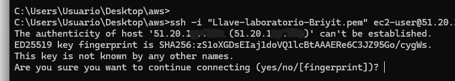
- se escribi yes 

### Comandos ejecutados
Listar buckets:

```bash
aws s3 ls
```
- 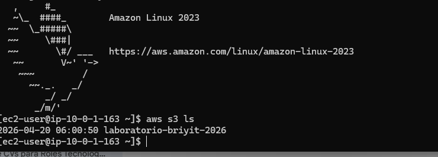
- Crear un archivo:

```bash
echo "Hola mundo, este es mi proyecto de ASIR desde el servidor" > prueba.txt
```bash
- 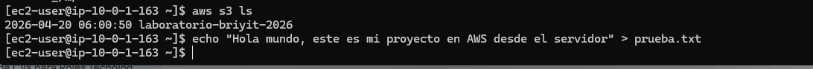

- Verificar que existe:

```bash
ls
```
Intentar subirlo:

```bash
aws s3 cp prueba.txt s3://laboratorio-briyit-2026/
```
- 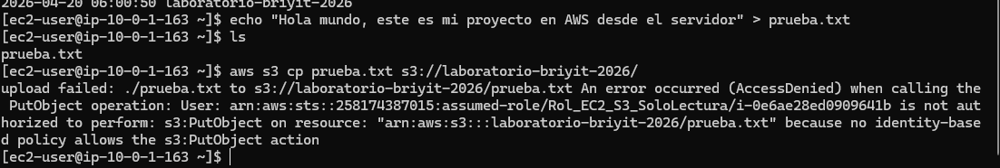

#### Resultado
- La subida falló porque el rol asignado solo tenía permisos de lectura.


## 8. Cierre de sesión y apagado de la instancia
Para evitar cargos innecesarios:
- Cerré la sesión SSH con:

```bash
exit
```

- 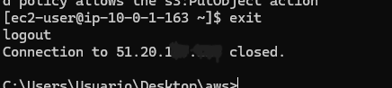
---
En EC2 seleccioné la instancia.
- Fui a Estado de la instancia > Detener (no Terminar).
- 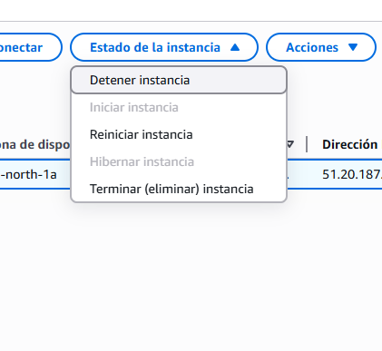
