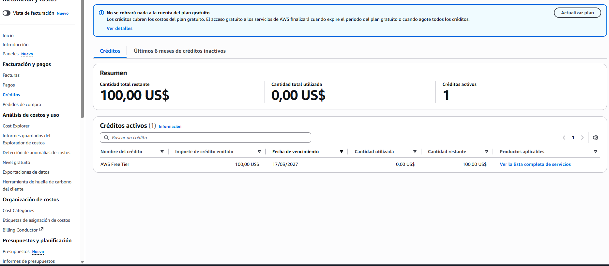
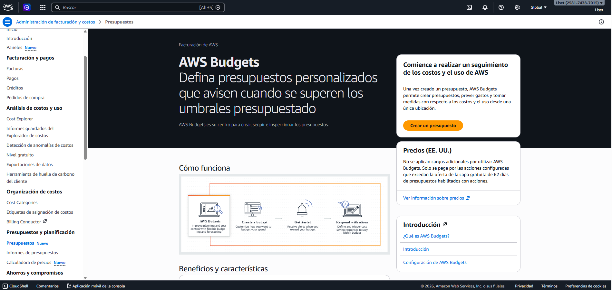
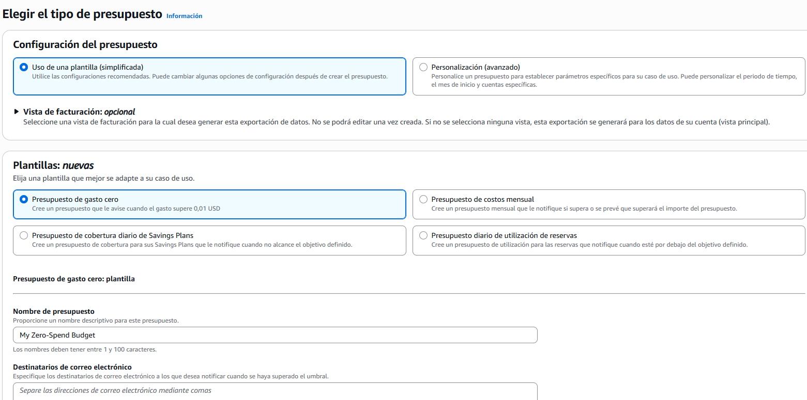
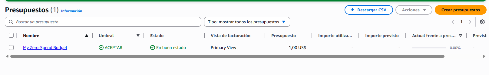
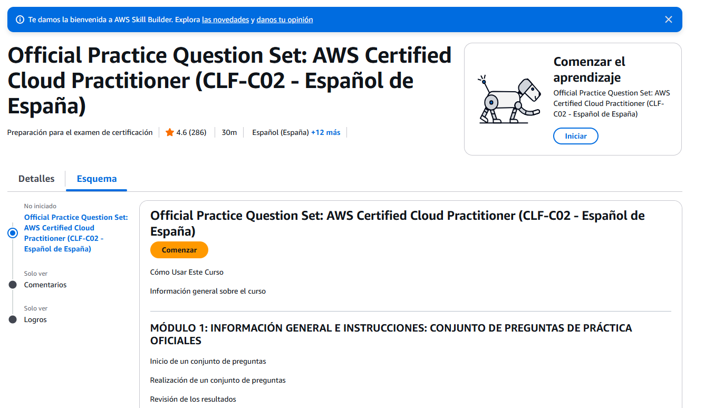
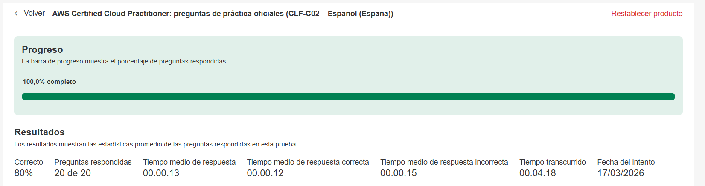

# Configuración Inicial en AWS Free Tier y Preparación para el Examen CLF‑C02

## 1. Créditos y Panel Principal de AWS
Al ingresar a la consola principal de AWS, se puede visualizar el resumen de créditos disponibles.
En este caso, la cuenta muestra:

- Crédito promocional: 100 USD
- Uso total: 0.00 USD
- Plan: AWS Free Tier

## 2. Creación de un Presupuesto (AWS Budgets)
Configurar un presupuesto es una buena práctica recomendada por AWS, ya que ayuda a evitar gastos inesperados.

### Pasos:
  1. En la consola, ir a la sección presupuesto.
  - 
  2. Seleccionar Budgets y luego Create budget.
  3. Elegir una plantilla simplificada.
  4.  Seleccionar la plantilla Zero-Spend Budget.
  5.  Aceptar y crear el presupuesto.
  - 
### Resultado:
- El presupuesto queda creado automáticamente.
- La alerta se activa cuando el gasto llega a 1.00 USD.
- Esto protege la cuenta ante cualquier servicio que accidentalmente genere costos.
- 
## 3. Simulacros del Examen CLF‑C02
- 
En AWS Skill Builder, dentro de la sección Bulk, se encuentra el simulacro:
- Official Practice Question Set – AWS Certified Cloud Practitioner (CLF‑C02) – Español (España)
- Resultado obtenido: 80%
- 
## 4. Conceptos Fundamentales para Reforzar
4.1 Modelo de Responsabilidad Compartida
Este es uno de los temas más frecuentes en el examen.

- AWS es responsable de la seguridad de la nube:
  - Hardware
  - Centros de datos
  - Infraestructura física
  - Red, energía y refrigeración
  - Software que opera la infraestructura

- El cliente es responsable de la seguridad en la nube:
  - Configuración de Security Groups
  - Gestión de usuarios y contraseñas
  - Cifrado de datos
  - Actualizaciones del sistema operativo en EC2
  - Configuración de permisos en S3

### Regla práctica:
- Si se puede tocar físicamente, es de AWS.
- Si se puede configurar, es responsabilidad del cliente.

## 4.2 AWS IAM (Identidad y Accesos)
Representa aproximadamente el 20% del examen.
- Usuarios: Personas reales.
- Grupos: Conjuntos de usuarios.
- Roles: Identidades temporales para servicios.
- Políticas: Reglas JSON que definen permisos.
- Principio de Menor Privilegio: Otorgar solo los permisos necesarios.

## 4.3 Planes de Soporte de AWS
|Plan	|Características |
|:--|:--|
|Basic	|Gratis. Soporte para facturación y seguridad.|
|Developer	|Soporte por email. Respuesta en 24 horas.|
|Business |	Soporte 24/7 por chat o teléfono. Respuesta menor a 1 hora en casos críticos.|
|Enterprise	|Incluye Technical Account Manager (TAM). Soporte prioritario.|

## 4.4 Diferencias entre Servicios Similares
### S3 vs EBS
- S3: Almacenamiento de objetos.
- EBS: Disco duro para instancias EC2.

### Lambda vs EC2
- EC2: Servidor siempre encendido.
- Lambda: Ejecución bajo demanda sin servidor.

### RDS vs DynamoDB
- RDS: Base de datos relacional.
- DynamoDB: Base de datos NoSQL altamente escalable.
